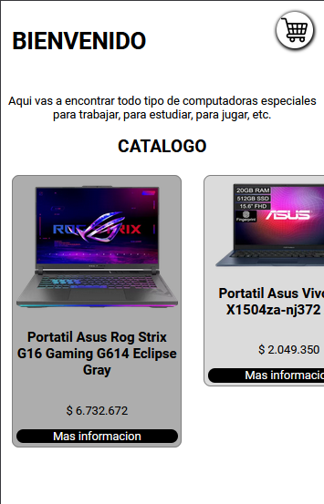
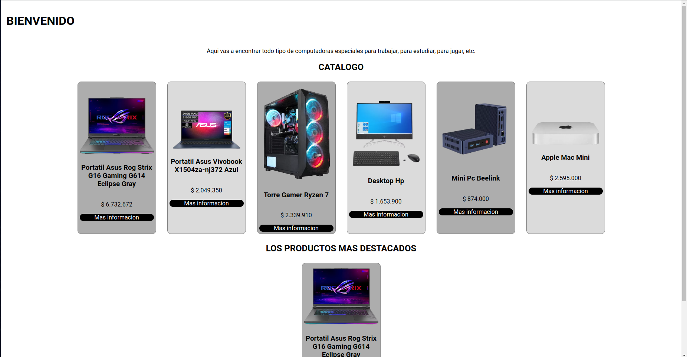
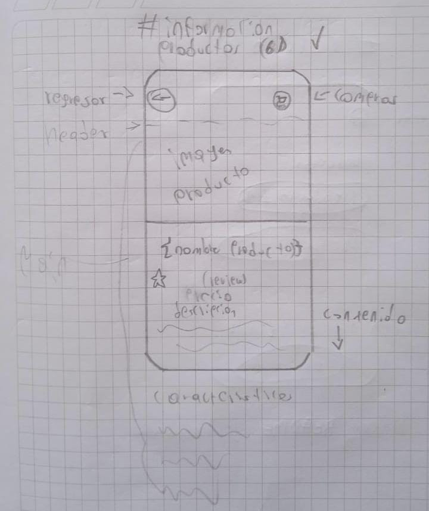
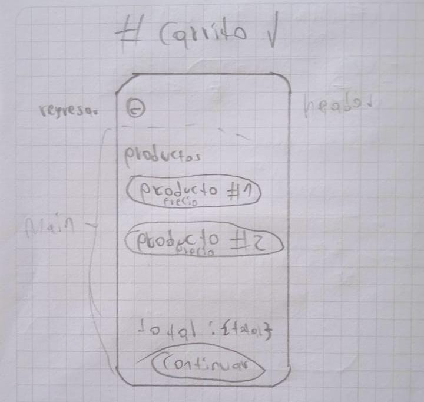
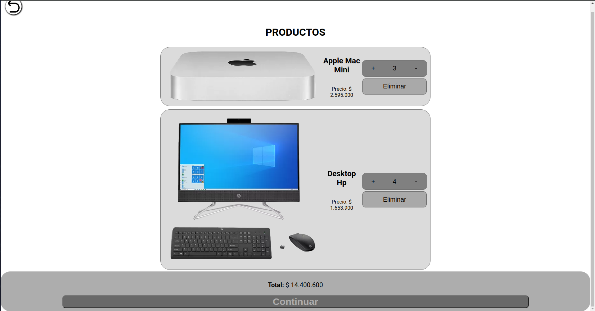

# Proyecto de HTML/CSS
## Tabla de contenidos
- [Descripcion](#descripcion)
- [Proceso](#proceso)
- [Caracteristicas](#caracteristicas)
- [Tecnologias](#tecnologias)
- [Screenshots](#screenshots)
- [Instalacion](#instalacion)
- [Uso](#uso)
- [Autor](#autor)
- [Contacto](#contacto)
### Descripcion
El proyecto trata sobre una tienda digital de computadoras donde se venden laptos, mini pc's y pc's de mesa.  

La pagina pricipal contiene los productos y los productos destacados, las paginas de informacion contienen la informacion de cada uno de los productos disponibles y la pagina del carrito contiene los productos que se van a comprar con la cantidad y el total.
### Proceso
El proceso para hacer el proyecto fue:
1. Primero hacer un esquema (wireframe) de como se iba a ver la pagina.
2. Empezar a diseñar la pagina principal (HTML), haciendolo semanticamente correcto.
3. Empezar a poner los estilos de la pagina principal (CSS).
4. Seguir haciendo las demas paginas (HTML) y agregandole los estilos (CSS).
5. Y agregar el responsive a todas las paginas para que respondan correctamente en todo tipo de telefonos y que solo funcione en telefonos.
6. Se agrego la logica a la pagina (JavaScript), lo que hace que se pueda agregar, comprar productos cargar pestañas, etc.
### Caracteristicas
El proyecto fue hecho con HTML para la estructuracion, CSS para el diseño y el responsive de las paginas y JavaScript para la logica de la pagina.
### Tecnologias
- HTML para la estructuracion.
- CCS para el diseño y responsive de las paginas.
- JavaScript para la logica de las paginas.
### Screenshots
  
El wireframe de la pagina principal.  
  
Resultado final en telefono.  
  
Resultado final en pc.  
***
  
El wireframe de la pagina de información.  
  
Resultado final en telefono.  
  
Resultado final en pc.  
***
  
El wireframe de la pagina del carrito.  
  
El wireframe de la pagina del carrito.  
  
El wireframe de la pagina del carrito.  
### Instalacion
Clonar repositorio
```sh
https://github.com/JavierEAcevedoN/PROYECTO-FILTRO_Acevedo_Javier_Noguera_Eduardo.git
```
### Uso
Ejecutar el index.html con Live Server o puedes utilizar el siguiente enlace:  
- [Pagina principal](https://javiereacevedon.github.io/PROYECTO-FILTRO_Acevedo_Javier_Noguera_Eduardo/Tienda_de_computadoras/Index.html)  
### Autor
- [JavierEAcevedoN](https://github.com/JavierEAcevedoN)
### Contacto
- Linkedin: [Javier Eduardo Acevedo Noguera](https://www.linkedin.com/in/javier-eduardo-acevedo-noguera)